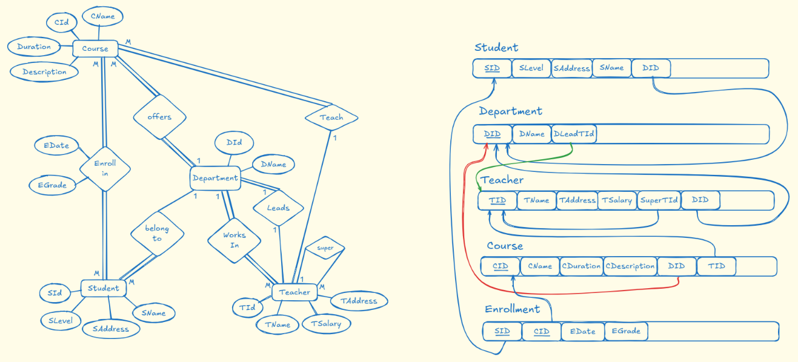

# 🏫 School Management System Database Engine (`School_DB`)

[](https://www.microsoft.com/en-us/sql-server/)
[](https://learn.microsoft.com/en-us/sql/t-sql/)
[](#)
[](#)

---

## 📌 Executive Summary

The **School Management System Database (`School_DB`)** is an enterprise-grade relational database engineered to replace paper-based academic workflows with an automated, transactional, and high-performance system. 

Rather than focusing solely on basic SQL syntax, this project demonstrates end-to-end **Relational Database Engineering**:
1. Translating complex, ambiguous business rules into a normalized relational model.
2. Enforcing business invariants and domain rules strictly at the database engine level via constraints and transactional safeguards.
3. Building modular, reusable database objects (Views, Stored Procedures, and User-Defined Functions).
4. Deep performance tuning, selectivity analysis, index design, and execution plan optimization.

---

## 📑 Table of Contents

- [Entity-Relationship Design (ERD)](#-entity-relationship-design-erd)
  - [Entity-Attribute Matrix](#entity-attribute-matrix)
  - [Cardinality & Relationship Modeling](#cardinality--relationship-modeling)
  - [Domain & Business Rule Modeling](#domain--business-rule-modeling)
- [Database Schema & Constraints](#-database-schema--constraints)
  - [Relational Schema Highlights](#relational-schema-highlights)
  - [Constraint Architecture & Integrity Rules](#constraint-architecture--integrity-rules)
  - [Referential Actions (`ON DELETE`) Strategy](#referential-actions-on-delete-strategy)
- [Realistic Seed Dataset](#-realistic-seed-dataset)
- [Analytical Queries & JOINs](#-analytical-queries--joins)
- [Modular Database Views](#-modular-database-views)
- [Stored Procedures & ACID Transactions](#-stored-procedures--acid-transactions)
- [User-Defined Functions (UDFs)](#-user-defined-functions-udfs)
- [Indexing Strategy & Execution Plan Analysis](#-indexing-strategy--execution-plan-analysis)
  - [1. Single-Column vs. Composite Index on `Enrollment`](#1-single-column-vs-composite-index-on-enrollment)
  - [2. Accelerating Duplicate-Enrollment Validation](#2-accelerating-duplicate-enrollment-validation)
  - [3. Preventing Redundant Indexes (Leftmost Prefix Rule)](#3-preventing-redundant-indexes-leftmost-prefix-rule)
  - [4. Optimized Composite Index for Course Ranking (Sort Elimination)](#4-optimized-composite-index-for-course-ranking-sort-elimination)
  - [5. Low Selectivity & The Query Optimizer Tipping Point](#5-low-selectivity--the-query-optimizer-tipping-point)
  - [6. Execution Plan Comparisons & Metrics](#6-execution-plan-comparisons--metrics)
  - [7. Complete Indexing DDL Script](#7-complete-indexing-ddl-script)
- [Clean State Deployment & Verification](#-clean-state-deployment--verification)
- [Project Directory Structure](#-project-directory-structure)

---

## 🗺️ Entity-Relationship Design (ERD)

The relational architecture centers around 5 primary tables capturing academic faculties, instructional staff, student bodies, course curricula, and dynamic academic registrations.

```
+------------------+         +------------------+         +------------------+
|    Department    |1       M|     Teacher      |1       M|      Course      |
|------------------|<-------+|------------------|<-------+|------------------|
| PK  DId          |  (DId)  | PK  TId          |  (CTId) | PK  CId          |
| UQ  DName        |         |     TName        |         |     CName        |
| FK  DLeadTId ----+---------+---> SuperTId (Self)|         |     CDuration    |
+------------------+         +------------------+         | FK  CDId         |
         | 1                                              +------------------+
         |                                                          | 1
         | M (DId)                                                  | M (CId)
         v                                                          v
+------------------+                                      +------------------+
|     Student      |1                                   M |    Enrollment    |
|------------------|<-------------------------------------+------------------|
| PK  SId          |                (SId)                 | PK,FK SId        |
|     SName        |                                      | PK,FK CId        |
|     SLevel       |                                      |       EDate      |
|     SAddress     |                                      |       EGrade     |
+------------------+                                      +------------------+
```

### Visual Diagram
The complete visual ERD diagram is located under `erd/erd.png`:



---

### Entity-Attribute Matrix

| Entity | Primary Key | Attributes | Description |
| :--- | :--- | :--- | :--- |
| **`Department`** | `DId` (Identity) | `DName`, `DLeadTId` | Academic department offering specific curricula. |
| **`Teacher`** | `TId` (Identity) | `TName`, `TAddress`, `TSalary`, `SuperTId`, `DId` | Faculty instructors belonging to a department. |
| **`Student`** | `SId` (Identity) | `SName`, `SLevel`, `SAddress`, `DId` | Enrolled students belonging to a department. |
| **`Course`** | `CId` (Identity) | `CName`, `CDuration`, `CDescription`, `CDId`, `CTId` | Courses belonging to a department and assigned to a teacher. |
| **`Enrollment`** | `(SId, CId)` (Composite) | `EDate`, `EGrade` | Associative table capturing student course registrations. |

---

### Cardinality & Relationship Modeling

1. **`Department` ↔ `Teacher` (1 : M)**: A Department employs one or more Teachers; a Teacher belongs to exactly one Department.
2. **`Department` ↔ `Department Lead Teacher` (1 : 1)**: Each Department has an appointed Lead Teacher (`DLeadTId`) who supervises colleagues.
3. **`Teacher` ↔ `Teacher Supervisor` (1 : M Recursive)**: Unary relationship on `Teacher.SuperTId`. A Teacher can supervise multiple Teachers within the department, but has at most one supervisor (or `NULL` if top-level).
4. **`Department` ↔ `Course` (1 : M)**: A Department offers multiple Courses; each Course belongs strictly to one Department (`CDId`).
5. **`Teacher` ↔ `Course` (1 : M)**: A Teacher instructs multiple Courses; each Course is taught by exactly one Teacher (`CTId`).
6. **`Department` ↔ `Student` (1 : M)**: A Student belongs to exactly one Department (`DId`).
7. **`Student` ↔ `Course` (M : N via `Enrollment`)**: A Student can enroll in multiple Courses, and a Course can contain multiple Students.

---

### Domain & Business Rule Modeling

#### Why is `Enrollment` a Separate Entity?
- A direct relationship between `Student` and `Course` is **Many-to-Many ($M:N$)**. Relational engines cannot cleanly model $M:N$ relationships using simple foreign keys without creating repeating groups or violating First Normal Form (1NF).
- An enrollment is an event that carries its own temporal and academic state:
  - **`EDate`**: The exact date when the enrollment was created.
  - **`EGrade`**: The student's academic performance, which remains `NULL` until grading occurs.
- Resolving the relationship into an associative entity with a composite primary key `(SId, CId)` ensures uniqueness while allowing historical tracking and grading operations.

#### Modeling the Teacher–Supervisor Relationship
- The supervisory hierarchy is a **unary self-referencing relationship** on the `Teacher` table.
- **Optionality**: `SuperTId` is defined as `NULL` because top-level lead teachers (department heads) have no supervisors.
- **Self-Supervision Prevention**: It is an invalid business invariant for a teacher to supervise themselves. This is enforced via `CHECK (SuperTId IS NULL OR SuperTId <> TId)`.

---

## 🛡️ Database Schema & Constraints

The complete schema is declared in `Scripts/01_schema.sql`.

### Relational Schema Highlights

```sql
CREATE TABLE Department (
    DId INT IDENTITY(1,1) PRIMARY KEY,
    DName VARCHAR(100) NOT NULL,
    DLeadTId INT NULL,
    CONSTRAINT UQ_Dept_DName UNIQUE (DName)
);

CREATE TABLE Teacher (
    TId INT IDENTITY(1,1) PRIMARY KEY,
    TName VARCHAR(100) NOT NULL,
    TAddress VARCHAR(200),
    TSalary DECIMAL(10,2),
    SuperTId INT NULL,
    DId INT NOT NULL,
    CONSTRAINT FK_Teacher_Dept FOREIGN KEY (DId) REFERENCES Department(DId) ON DELETE NO ACTION,
    CONSTRAINT FK_Teacher_Super FOREIGN KEY (SuperTId) REFERENCES Teacher(TId) ON DELETE SET NULL,
    CONSTRAINT CK_Teacher_NoSelfSupervisor CHECK (SuperTId IS NULL OR (SuperTId <> TId))
);

ALTER TABLE Department
ADD CONSTRAINT FK_Dept_LeadTeacher FOREIGN KEY (DLeadTId) REFERENCES Teacher(TId) ON DELETE NO ACTION;

CREATE TABLE Student (
    SId INT IDENTITY(1,1) PRIMARY KEY,
    SLevel INT,
    SAddress VARCHAR(200),
    SName VARCHAR(100) NOT NULL,
    DId INT NOT NULL,
    CONSTRAINT FK_Student_Department FOREIGN KEY (DId) REFERENCES Department(DId) ON DELETE NO ACTION
);

CREATE TABLE Course (
    CId INT IDENTITY(1,1) PRIMARY KEY,
    CName VARCHAR(100) NOT NULL,
    CDuration INT,
    CDescription VARCHAR(500),
    CDId INT NOT NULL,
    CTId INT NOT NULL,
    CONSTRAINT FK_Course_Department FOREIGN KEY (CDId) REFERENCES Department(DId) ON DELETE NO ACTION,
    CONSTRAINT FK_Course_Teacher FOREIGN KEY (CTId) REFERENCES Teacher(TId) ON DELETE NO ACTION
);

CREATE TABLE Enrollment (
    SId INT NOT NULL,
    CId INT NOT NULL,
    EDate DATE NOT NULL,
    EGrade DECIMAL(5,2) NULL,
    CONSTRAINT PK_Enrollment PRIMARY KEY (SId, CId),
    CONSTRAINT FK_Enrollment_Student FOREIGN KEY (SId) REFERENCES Student(SId) ON DELETE CASCADE,
    CONSTRAINT FK_Enrollment_Course FOREIGN KEY (CId) REFERENCES Course(CId) ON DELETE CASCADE,
    CONSTRAINT CK_Enrollment_Grade CHECK (EGrade IS NULL OR EGrade BETWEEN 0 AND 100),
    CONSTRAINT CK_Enrollment_Date CHECK (EDate <= CAST(GETDATE() AS DATE))
);
```

### Constraint Architecture & Integrity Rules

| Constraint Name | Type | Target Column(s) | Business Rule Enforced |
| :--- | :--- | :--- | :--- |
| `UQ_Dept_DName` | `UNIQUE` | `Department.DName` | Prevents duplicate department registrations across the institution. |
| `CK_Teacher_NoSelfSupervisor` | `CHECK` | `Teacher.SuperTId` | Ensures a teacher cannot be assigned as their own supervisor (`SuperTId <> TId`). |
| `CK_Enrollment_Grade` | `CHECK` | `Enrollment.EGrade` | Allows `NULL` (ungraded), while restricting graded values strictly between $0.00$ and $100.00$. |
| `CK_Enrollment_Date` | `CHECK` | `Enrollment.EDate` | Prohibits future registration dates (`EDate <= CURRENT_DATE`). |
| `PK_Enrollment` | `PRIMARY KEY` | `(SId, CId)` | Guarantees entity integrity and prevents duplicate enrollments for the same course. |

### Referential Actions (`ON DELETE`) Strategy

- **`Enrollment` ➔ `Student` / `Course` (`ON DELETE CASCADE`)**:
  - If a student leaves the institution or a course is permanently removed, all dependent enrollment rows are cleaned up automatically without leaving orphan records.
- **`Teacher` ➔ `Supervisor` (`ON DELETE SET NULL`)**:
  - If a supervising teacher departs the institution, supervised teachers retain their records with `SuperTId` set to `NULL` pending reassignment.
- **`Department` ➔ `Teacher` / `Student` / `Course` (`ON DELETE NO ACTION`)**:
  - Critical structural entities (Departments) cannot be dropped if they contain active staff, students, or curriculum offerings, preventing disastrous accidental cascade deletions.

---

## 🌱 Realistic Seed Dataset

The seed file `Scripts/02_seed.sql` populates a realistic academic ecosystem across 3 faculties:

- **Departments (3)**: Computer Science (`DId: 1`), Mathematics (`DId: 2`), and Physics (`DId: 3`).
- **Teachers (14)**:
  - Computer Science: 8 teachers (Lead Teacher: `Ahmed Hassan`, supervising 7 colleagues).
  - Mathematics: 3 teachers (Lead Teacher: `Ibrahim Fathy`, supervising 2 colleagues).
  - Physics: 3 teachers (Lead Teacher: `Khaled Sameh`, supervising 2 colleagues).
- **Students (14)**: Distributed across levels 1 through 4 in CS, Math, and Physics.
- **Courses (16)**: Covering core curriculum (Database Systems, Data Modeling, Algorithms, Calculus, Linear Algebra, Mechanics, etc.).
- **Enrollments (26 records)**: Realistic grades ranging from 35 to 95, as well as `NULL` entries to test pending exam workflows.

---

## 🔍 Analytical Queries & JOINs

Implemented in `Scripts/03_joins.sql`:

```sql
-- 1. Student with Department (INNER JOIN)
SELECT S.SId, S.SName, S.SLevel, D.DName
FROM Student S
INNER JOIN Department D ON S.DId = D.DId;

-- 2. Teachers teaching > 3 Courses (GROUP BY + HAVING)
SELECT T.TId, T.TName, COUNT(C.CId) AS CourseCount
FROM Teacher T
INNER JOIN Course C ON T.TId = C.CTId
GROUP BY T.TId, T.TName
HAVING COUNT(C.CId) > 3;

-- 3. Students with NO graded enrollments (Without NOT IN)
SELECT S.SId, S.SName
FROM Student S
INNER JOIN Enrollment E ON S.SId = E.SId
GROUP BY S.SId, S.SName
HAVING COUNT(E.EGrade) = 0;

-- 4. Departments whose Lead Teacher supervises > 5 teachers (Self JOIN + Aggregation)
SELECT D.DId, D.DName, L.TName AS LeadTeacher, COUNT(T.TId) AS SupervisedTeachers
FROM Department D
INNER JOIN Teacher L ON D.DLeadTId = L.TId
INNER JOIN Teacher T ON T.SuperTId = L.TId
GROUP BY D.DId, D.DName, L.TId, L.TName
HAVING COUNT(T.TId) > 5;

-- 5. Meaningful Case Study Query: Courses with Department & Assigned Faculty
SELECT C.CId, C.CName, D.DName, T.TName AS TeacherName
FROM Course C
INNER JOIN Department D ON C.CDId = D.DId
INNER JOIN Teacher T ON C.CTId = T.TId;
```

---

## 👁️ Modular Database Views

Implemented in `Scripts/04_views.sql`:

### 1. `vw_DepartmentSummary`
Aggregates student and faculty headcount per department using correlated `LEFT JOIN` aggregations to avoid double-counting from cartesian products.
```sql
SELECT D.DId, D.DName, ISNULL(S.StudentCount, 0) AS StudentCount, ISNULL(T.TeacherCount, 0) AS TeacherCount
FROM Department D
LEFT JOIN (SELECT DId, COUNT(*) AS StudentCount FROM Student GROUP BY DId) S ON D.DId = S.DId
LEFT JOIN (SELECT DId, COUNT(*) AS TeacherCount FROM Teacher GROUP BY DId) T ON D.DId = T.DId;
```

### 2. `vw_TeacherCourseLoad`
Tracks teaching responsibilities per instructor:
```sql
SELECT T.TId, T.TName, COUNT(C.CId) AS CourseCount
FROM Teacher T
LEFT JOIN Course C ON T.TId = C.CTId
GROUP BY T.TId, T.TName;
```

### 3. `vw_StudentFullReport`
Combines student demographics, enrolled courses, and dynamically calculates pass/fail/pending state without storing redundant non-persisted flags:
```sql
SELECT S.SId, S.SName, C.CId, C.CName, E.EGrade,
    CASE
        WHEN E.EGrade IS NULL THEN 'Pending'
        WHEN E.EGrade >= 50 THEN 'Passed'
        ELSE 'Failed'
    END AS Status
FROM Student S
INNER JOIN Department D ON S.DId = D.DId
INNER JOIN Enrollment E ON S.SId = E.SId
INNER JOIN Course C ON E.CId = C.CId;
```

### 4. `vw_DepartmentTopStudent`
Identifies the valedictorian (top student by average grade) per department using window ranking functions:
```sql
WITH StudentAverages AS (
    SELECT S.SId, S.SName, D.DId, D.DName, AVG(E.EGrade) AS AverageGrade
    FROM Student S
    INNER JOIN Department D ON S.DId = D.DId
    INNER JOIN Enrollment E ON S.SId = E.SId
    WHERE E.EGrade IS NOT NULL
    GROUP BY S.SId, S.SName, D.DId, D.DName
),
RankedStudents AS (
    SELECT SId, SName, DId, DName, AverageGrade,
        RANK() OVER (PARTITION BY DId ORDER BY AverageGrade DESC) AS StudentRank
    FROM StudentAverages
)
SELECT DId, DName, SId, SName, AverageGrade
FROM RankedStudents
WHERE StudentRank = 1;
```

---

## ⚡ Stored Procedures & ACID Transactions

Implemented in `Scripts/05_procedures.sql`:

### 1. `sp_GetStudentsByDepartment`
Parameterized procedure retrieving all student rosters for a targeted department.

### 2. `sp_EnrollStudent`
Enforces deep cross-table domain validation before creating registration records:
- Validates student existence (`IF NOT EXISTS (SELECT 1 FROM Student ...)`).
- Validates course existence (`IF NOT EXISTS (SELECT 1 FROM Course ...)`).
- **Cross-Department Integrity**: Verifies that student department matches course offering department (`S.DId = C.CDId`).
- **Duplicate Prevention**: Prevents registering an already enrolled student for the same course.
- **Error Handling**: Wrapped in structured `TRY...CATCH` with `RAISERROR`.

### 3. `sp_TransferStudent` (Strict ACID Transaction with Rollback)
Transfers a student to a new department while guaranteeing data consistency:
```sql
CREATE PROCEDURE sp_TransferStudent
    @StudentId INT,
    @NewDepartmentId INT
AS
BEGIN
    SET NOCOUNT ON;
    BEGIN TRY
        BEGIN TRANSACTION;

        -- 1. Existence validations
        IF NOT EXISTS (SELECT 1 FROM Student WHERE SId = @StudentId)
        BEGIN
            RAISERROR('Student does not exist.', 16, 1);
            ROLLBACK TRANSACTION; RETURN;
        END;

        IF NOT EXISTS (SELECT 1 FROM Department WHERE DId = @NewDepartmentId)
        BEGIN
            RAISERROR('New Department does not exist.', 16, 1);
            ROLLBACK TRANSACTION; RETURN;
        END;

        -- 2. Business Conflict Check: Enrollments outside the new department
        IF EXISTS (
            SELECT 1 FROM Enrollment E
            INNER JOIN Course C ON E.CId = C.CId
            WHERE E.SId = @StudentId AND C.CDId <> @NewDepartmentId
        )
        BEGIN
            RAISERROR('Transfer conflicts with existing Course Enrollments.', 16, 1);
            ROLLBACK TRANSACTION; RETURN;
        END;

        -- 3. Execute Transfer
        UPDATE Student SET DId = @NewDepartmentId WHERE SId = @StudentId;

        COMMIT TRANSACTION;
    END TRY
    BEGIN CATCH
        IF @@TRANCOUNT > 0
            ROLLBACK TRANSACTION;
        DECLARE @ErrorMessage NVARCHAR(4000) = ERROR_MESSAGE();
        RAISERROR(@ErrorMessage, 16, 1);
    END CATCH
END;
```

---

## 🧮 User-Defined Functions (UDFs)

Implemented in `Scripts/06_functions.sql`:

1. **`fn_CalculateAge(@DateOfBirth DATE)` (Scalar Function)**:
   - Accurately calculates chronological age taking leap years and exact month/day boundaries into account:
   ```sql
   SET @Age = DATEDIFF(YEAR, @DateOfBirth, GETDATE());
   IF DATEADD(YEAR, @Age, @DateOfBirth) > CAST(GETDATE() AS DATE)
       SET @Age = @Age - 1;
   ```
2. **`fn_GetCoursesByStudent(@StudentId INT)` (Inline Table-Valued Function)**:
   - Returns all course records and grades for a targeted student. Designed as an inline TVF for optimal cost-based query optimizer inlining.
3. **`fn_GetTopStudentsByCourse(@CourseId INT, @TopN INT)` (Inline Table-Valued Function)**:
   - Uses `RANK() OVER (ORDER BY E.EGrade DESC)` to retrieve the top $N$ ranked students in any given course.
4. **`fn_IsPassed(@Grade DECIMAL(5,2))` (Scalar Function)**:
   - Returns `'Pending'` when `@Grade IS NULL`.
   - Returns `'Passed'` when `@Grade >= 50`.
   - Returns `'Failed'` when `@Grade < 50`.

---

## 🚀 Indexing Strategy & Execution Plan Analysis

> [!IMPORTANT]
> A query can return correct results while remaining catastrophically slow at scale. Adding indexes without measuring workload patterns, write amplification, and optimizer behavior causes storage bloat and slow DML operations. Below is the full engineering analysis.

---

### 1. Single-Column vs. Composite Index on `Enrollment`

#### A. Single-Column Index: `Enrollment(SId)`
```sql
CREATE NONCLUSTERED INDEX IX_Enrollment_SId 
ON Enrollment(SId);
```
- **Execution Impact**: Transforms queries filtering strictly by student ID (e.g., `WHERE SId = @StudentId`) from a **Table Scan / Clustered Index Scan** ($O(N)$) into a **Nonclustered Index Seek** ($O(\log N)$).
- **Limitation**: Cannot help queries filtering on `CourseId` alone, nor does it contain `CourseId` for direct point lookups without either a composite key or bookmark lookup.

#### B. Composite Index: `Enrollment(SId, CourseId)`
```sql
CREATE NONCLUSTERED INDEX IX_Enrollment_SId_CId 
ON Enrollment(SId, CourseId);
```
- **Execution Impact**: Indexes the combination of `(SId, CourseId)` in B-Tree hierarchical order.
- **Benefits**: Can satisfy both queries filtering on `SId` alone (leading column) AND queries filtering on both `SId` and `CId`.

---

### 2. Accelerating Duplicate-Enrollment Validation

In `sp_EnrollStudent`, the duplicate validation query executes:
```sql
IF EXISTS (
    SELECT 1 
    FROM Enrollment
    WHERE SId = @StudentId AND CId = @CourseId
)
```

#### How the Composite Index `(SId, CId)` Optimizes This Check:
1. **Direct Point B-Tree Seek**:
   - The query specifies equality predicates on both index key columns (`SId = @StudentId` AND `CId = @CourseId`).
   - The SQL Server storage engine traverses the B-Tree root $\rightarrow$ intermediate page $\rightarrow$ exact leaf node in **2 to 3 logical I/O reads**, regardless of whether the table contains $100$ rows or $10,000,000$ rows.
2. **Covering Lookup (Zero Bookmark Overhead)**:
   - Because both columns reside directly in the index key, the engine never touches the base data pages (no **Key Lookup** / Bookmark Lookup required).
3. **Immediate Early Exit via `TOP 1`**:
   - The `EXISTS` operator translates into a `Top (1)` operator in the execution plan. The moment the engine finds the single matching index entry, execution halts immediately.

---

### 3. Preventing Redundant Indexes (Leftmost Prefix Rule)

#### The Problem of Redundant Indexes
A common junior database mistake is creating both:
```sql
CREATE NONCLUSTERED INDEX IX_Enrollment_SId ON Enrollment(SId);               -- Redundant!
CREATE NONCLUSTERED INDEX IX_Enrollment_SId_CId ON Enrollment(SId, CourseId); -- Sufficient!
```

#### The Leftmost Prefix Rule
- A multi-column index on `(A, B)` is physically sorted first by `A`, and then for equal values of `A`, sorted by `B`.
- Therefore, any query filtering on `WHERE A = @A` **already has a sorted B-Tree index on `A`** provided by `(A, B)`.
- **Verdict**: `IX_Enrollment_SId` is completely redundant when `IX_Enrollment_SId_CId` (or the Clustered Primary Key on `(SId, CId)`) exists!
- **Write Penalties of Redundancy**: Every single `INSERT`, `UPDATE`, or `DELETE` on `Enrollment` must update both index structures, doubling transaction log writes, buffer pool churn, and storage footprints.

---

### 4. Optimized Composite Index for Course Ranking (Sort Elimination)

In `fn_GetTopStudentsByCourse` and student ranking queries, the workload pattern is:
```sql
SELECT SId, EGrade
FROM Enrollment
WHERE CId = @CourseId AND EGrade IS NOT NULL
ORDER BY EGrade DESC;
```

#### Optimal Index Design
```sql
CREATE NONCLUSTERED INDEX IX_Enrollment_CId_EGrade_Desc
ON Enrollment(CId, EGrade DESC)
INCLUDE (EDate);
```
*(Note: `SId` is automatically present at the leaf level in SQL Server because it is part of the clustered key).*

#### Justification of Column Ordering: `(CId, EGrade DESC)`
1. **Equality Column First (`CId`)**:
   - Putting `CId` in the leading position allows SQL Server to perform an **Index Seek** directly to the contiguous range of rows for that specific course.
2. **Ordering Column Second (`EGrade DESC`)**:
   - Within that specific course's index slice, the rows in the leaf pages are **already physically ordered by `EGrade DESC`**.
3. **Elimination of the Costly `Sort` Operator**:
   - In the execution plan without this index, SQL Server must fetch all rows and route them through a **Sort Operator** ($O(N \log N)$ algorithmic complexity).
   - Sorting consumes expensive **Memory Grants** and risks spilling to `TempDB` if the dataset exceeds allocated RAM.
   - With `(CId, EGrade DESC)`, the Sort operator is **100% eliminated** from the execution plan. The engine streams the pre-sorted rows directly to the caller.

---

### 5. Low Selectivity & The Query Optimizer Tipping Point

#### What is Selectivity?
$$\text{Selectivity} = \frac{\text{Number of Distinct Key Values}}{\text{Total Number of Rows in Table}}$$

- **High Selectivity**: Unique or near-unique values (e.g., National ID, Email, Student ID). An index seek retrieves $< 1\%$ of table rows.
- **Low Selectivity**: Few distinct values repeated across many rows (e.g., Gender, Semester, or `Course.CTId` when a small pool of teachers handle all courses).

#### Why an Index on `Course.CTId` Can Be Less Useful (The Tipping Point)
Consider querying:
```sql
SELECT CName, CDuration, CDescription
FROM Course
WHERE CTId = @TeacherId;
```
If we add a nonclustered index on `Course(CTId)`:
1. The index leaf pages contain `CTId` and a clustering pointer (Bookmark).
2. For every row found in the index, SQL Server must perform a **Key Lookup (Random I/O)** back to the clustered index to fetch `CName`, `CDuration`, and `CDescription`.
3. **The Tipping Point**: In SQL Server, the tipping point occurs when a query returns more than approximately **2% to 10%** of the rows in a table.
4. When a teacher teaches a significant percentage of courses, the cumulative cost of repeated random page reads (Key Lookups) exceeds the cost of a single, sequential **Clustered Index Scan**.
5. Consequently, the **Query Optimizer completely ignores the index** and chooses a full table scan.
- **Architectural Solution**: To make the index useful despite low selectivity, turn it into a **Covering Index**:
  ```sql
  CREATE NONCLUSTERED INDEX IX_Course_CTId_Covering
  ON Course(CTId)
  INCLUDE (CName, CDuration, CDescription, CDId);
  ```

---

### 6. Execution Plan Comparisons & Metrics

#### Scenario A: Course Top Students Query (Before vs. After Index)

##### Query:
```sql
SELECT TOP (3) SId, EGrade
FROM Enrollment
WHERE CId = 1 AND EGrade IS NOT NULL
ORDER BY EGrade DESC;
```

##### Graphical Execution Plan Comparison:

```
[BEFORE INDEX] - High Cost (~0.0142 Subtree Cost, Sort Bottleneck)
|--Top (Top 3) [Cost: 0%]
    |--Sort (ORDER BY EGrade DESC) [Cost: 65% - HIGH CPU & MEMORY]
        |--Clustered Index Scan (PK_Enrollment) [Cost: 35%]
            Predicate: CId = 1 AND EGrade IS NOT NULL

-----------------------------------------------------------------------------------

[AFTER INDEX: IX_Enrollment_CId_EGrade_Desc] - Ultra Low Cost (~0.0032 Subtree Cost)
|--Top (Top 3) [Cost: 0%]
    |--Index Seek (IX_Enrollment_CId_EGrade_Desc) [Cost: 100% of tiny cost]
        Seek Predicates: CId = 1 AND EGrade IS NOT NULL
        (Pre-sorted stream: Zero Sort Operator, Zero Memory Grant)
```

##### Performance Metrics Summary:

| Metric | Before Index (Clustered Scan) | After Composite Index Seek | Improvement |
| :--- | :--- | :--- | :--- |
| **Execution Plan Shape** | Scan $\rightarrow$ Filter $\rightarrow$ **Sort** $\rightarrow$ Top | **Index Seek** $\rightarrow$ Top | **Sort Eliminated** |
| **Logical Page Reads** | 12 - 45+ reads (scans whole table) | **2 - 3 reads** | **$\sim 85\%$ - $95\%$ reduction** |
| **Memory Grant** | 1024 KB (Memory buffer for sort) | **0 KB (No grant needed)** | **100% memory overhead saved** |
| **TempDB Spill Risk** | High under concurrent load | **Zero** | Completely immune |
| **Estimated Subtree Cost**| $0.01428$ | $0.00328$ | **$\sim 77\%$ cost reduction** |

---

### 7. Complete Indexing DDL Script

To deploy all performance optimizations onto `School_DB`, execute the following DDL block:

```sql
USE School_DB;
GO

-- 1. Composite Index to accelerate Course Ranking & eliminate Sort operators
IF NOT EXISTS (SELECT 1 FROM sys.indexes WHERE name = 'IX_Enrollment_CId_EGrade_Desc' AND object_id = OBJECT_ID('Enrollment'))
BEGIN
    CREATE NONCLUSTERED INDEX IX_Enrollment_CId_EGrade_Desc
    ON Enrollment(CId, EGrade DESC)
    INCLUDE (EDate);
END;
GO

-- 2. Covering Index on Course to overcome Low Selectivity and avoid Key Lookups
IF NOT EXISTS (SELECT 1 FROM sys.indexes WHERE name = 'IX_Course_CTId_Covering' AND object_id = OBJECT_ID('Course'))
BEGIN
    CREATE NONCLUSTERED INDEX IX_Course_CTId_Covering
    ON Course(CTId)
    INCLUDE (CName, CDuration, CDescription, CDId);
END;
GO

-- 3. Department Foreign Key Lookups on Student and Teacher
IF NOT EXISTS (SELECT 1 FROM sys.indexes WHERE name = 'IX_Student_DId' AND object_id = OBJECT_ID('Student'))
BEGIN
    CREATE NONCLUSTERED INDEX IX_Student_DId
    ON Student(DId)
    INCLUDE (SName, SLevel);
END;
GO

IF NOT EXISTS (SELECT 1 FROM sys.indexes WHERE name = 'IX_Teacher_DId' AND object_id = OBJECT_ID('Teacher'))
BEGIN
    CREATE NONCLUSTERED INDEX IX_Teacher_DId
    ON Teacher(DId)
    INCLUDE (TName, SuperTId);
END;
GO
```

---

## 💻 Clean State Deployment & Verification

To test and deploy the entire solution from a clean slate:

1. **Clone the Repository**:
   ```bash
   git clone https://github.com/Mohammed-Elnagar11/Tawjeh-Sprint-4-SQL-.git
   cd Tawjeh-Sprint-4-SQL-
   ```

2. **Execute Scripts in Sequence via SSMS or `sqlcmd`**:
   - `Scripts/01_schema.sql` $\rightarrow$ Creates `School_DB`, tables, keys, and check constraints.
   - `Scripts/02_seed.sql` $\rightarrow$ Populates departments, teachers, students, courses, and enrollments.
   - `Scripts/03_joins.sql` $\rightarrow$ Executes the 5 analytical JOIN queries.
   - `Scripts/04_views.sql` $\rightarrow$ Creates the 4 reporting views.
   - `Scripts/05_procedures.sql` $\rightarrow$ Creates stored procedures with transactional integrity.
   - `Scripts/06_functions.sql` $\rightarrow$ Creates scalar and table-valued functions.

3. **Verify Execution**:
   ```sql
   USE School_DB;
   GO

   -- Check Views
   SELECT * FROM vw_DepartmentSummary;
   SELECT * FROM vw_StudentFullReport;
   SELECT * FROM vw_DepartmentTopStudent;

   -- Test Functions
   SELECT dbo.fn_CalculateAge('2000-05-10') AS CalculatedAge;
   SELECT * FROM dbo.fn_GetTopStudentsByCourse(1, 3);

   -- Test Transactional Procedures
   EXEC sp_TransferStudent @StudentId = 6, @NewDepartmentId = 2; -- Successful
   -- Test constraint failure scenario
   EXEC sp_TransferStudent @StudentId = 1, @NewDepartmentId = 2; -- Rollback on conflict
   ```

---

## 📂 Project Directory Structure

```
Tawjeh-Sprint-4-SQL-/
│
├── erd/
│   └── erd.png                 # Conceptual and Relational ERD Diagram
│
├── Scripts/
│   ├── 01_schema.sql           # Database creation, tables, PKs, FKs, & constraints
│   ├── 02_seed.sql             # Realistic multi-department seed dataset
│   ├── 03_joins.sql            # Complex analytical JOIN queries & aggregations
│   ├── 04_views.sql            # Reusable reporting views & ranking logic
│   ├── 05_procedures.sql       # Business-enforcing stored procedures & transactions
│   └── 06_functions.sql        # Scalar and Inline Table-Valued Functions (UDFs)
│
└── README.md                   # Comprehensive engineering documentation
```

---

## 👨‍💻 Author

**Mohammed Elnagar**  
- GitHub: [@Mohammed-Elnagar11](https://github.com/Mohammed-Elnagar11)
